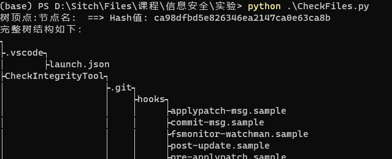
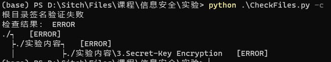
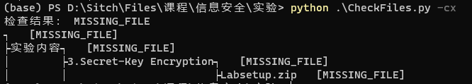

# Check Integrity Tool 验证文件完整性工具

**生成校验文件，以供后续检查验证**

对指定目录及其子目录生成Merkle hash 树，在每个子树中使用.hash文件保存该子树根节点的Hash值，使用.tree保存子树结构。对总树根节点的Hash值进行数字签名，保存为.sign。最终自动显示目录树。

**检查当前文件，是否与校验文件一致**

对指定目录及其子目录生成Merkle hash 树，并与每个子树的.hash文件保存值进行比较，最终自动显示所有错误**目录**节点。

**强化检查**

读取根目录的.tree树结构，遍历检查每个树节点，最终自动显示所有错误节点 **(包括文件)**。

**生成RSA key**

在指定目录下通过sign_key,sign_key.pub文件保存用于数字签名的key。


## Usage 使用方法

- ```-h, --help```         show this help message and exit
- ```-d DIR, --dir DIR```  指定目录
- ```--hash HASH```        指定Hash方法 支持HMAC, MD2, MD4, MD5, RIPEMD160, SHA1,SHA224, SHA256, SHA384, SHA512, CMAC,
                     Poly1305,cSHAKE128, cSHAKE256, KMAC128, KMAC256,TupleHash128, TupleHash256, KangarooTwelve
- ```-c, --check```        是否进行验证
- ```-cx, --checkplus```   是否进行文件树验证
- ```-g, --generateKey```  进行签名秘钥生成

```shell
python CheckIntegrity.py [-d='path/to/your/dir'] [--hash=MD5] [-cx/-c] 
```

# 效果截图

生成校验文件，并显示完整目录树



检查目录



强化检查目录


